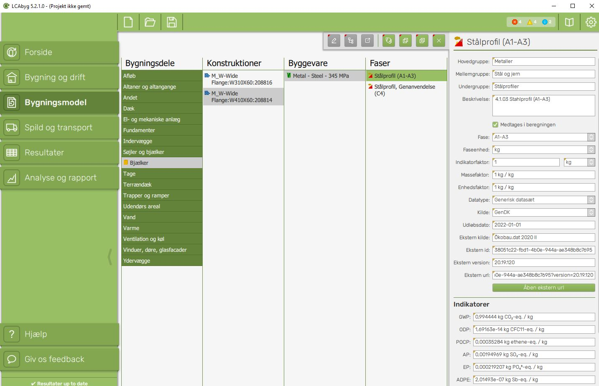

# A4-Final-Project-
# 41934 Advanced BIM, Assaignment 4 Final Project
## Group 16: Isabella Vad (s183616) and Amalie Hartvig Jensen (s183619)

Goal: The goal of this tool is to provide an overview of LCA results (CO2 emissions) on building elements within a building project from an IFC- file.

**Step-by-step guide to use the tool:**

1. Export your BIM project to .ifc file format and save on your device. 
2. Open the main.py file in the tool folder.
3. In code line XX, insert the file path of your .ifc file. 
4. Press Run code. -> .json files will automatically be generated in the tool folder in a folder named ‘output’. 
5. Open LCAbyg 5 (v.5.2.1.0) or install LCAbyg from: https://old.lcabyg.dk/download-program
6. In LCAbyg, click on ‘Filer’ -> ‘Ny’ ->  ‘Tomt projekt’, to open a new empty project.  
7. Click on ‘Filer’ -> ‘importer komponenter fra json’, to import generated json components. 
8. Choose the generated ‘output’ folder and press ‘Select Folder’ 
9. Under the ‘Bygningsmodel’ module, the building element beams from the ifc file are generated and displaying its corresponding data ‘Konstruktioner’, ‘Byggevare’, ‘Faser’ by clicking on the element (see Figure 1). Note, the amounts(‘mængde’) and units under the ‘Konstruktioner’ and ‘Byggevarer’ tabs must be manually specified. 
10. Read the LCA results under the ‘Resultater’ module and in ‘Analyse og rapport’ for graphic representations. 
figure 1

**Further work**
Due to the time constraints only beams from the IFC file is identified and loaded into LCAbyg thorugh this tool. 
However the same approach applies for all IFC elements why these can potentially be implementet in the tool to get a full LCA of the IFC building. 
It is possible to expand the number of json files to incorporate information of the project and building data.  
